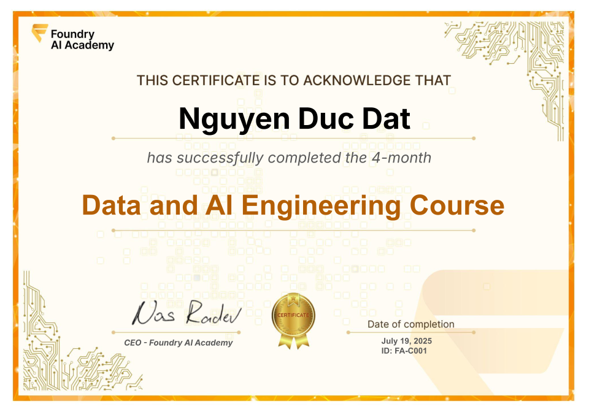

# Certificate of Achievement: Data & AI Engineering Course v1

## Awarded to **Dat Nguyen**

[Download Certificate (PDF) :fontawesome-solid-download:](trainee-dat-nguyen-2025-07.pdf){ .md-button .md-button--primary }

### Certificate Details
- **Certificate ID**: `FA-C001`
- **Certificate Holder ID**: `FA-C001/trainee-dat-nguyen-2025-07`

### Course Information
- **Course**: [Data & AI Engineering Course v1](https://www.foundry.academy/)

### Issued by
[**Foundry AI Academy**](https://www.foundry.academy/)

### Certification Period
- **Issued**: July 2025
- **Valid Until**: No expiration

### Comments
We proudly commend Dat Nguyen for their outstanding achievement and successful completion of the Data & AI Engineering Course v1, demonstrating excellence, dedication, and a commitment to continuous learning.

---

For more information about our programs, visit [Foundry AI Academy](https://www.foundry.academy/).