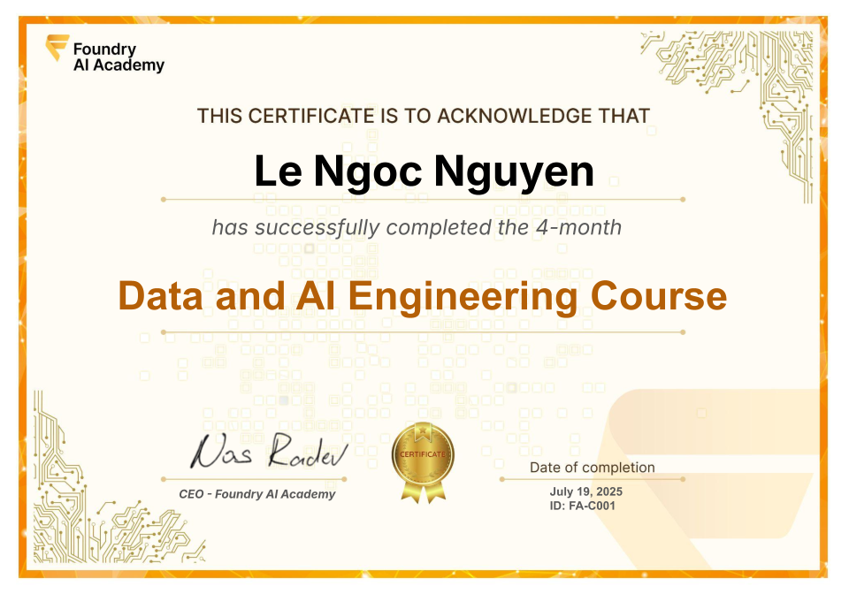

# Certificate of Achievement: Data & AI Engineering

## Awarded to **Nguyen Le Ngoc**

### Certificate Details
- **Certificate ID**: `FoudryAI-C1`
- **Certificate Holder ID**: `FoudryAI-C1/trainee-nguyen-le-ngoc-2025-07`

### Course Information
- **Course**: [Data & AI Engineering](https://www.foundry.academy/)

### Issued by
[**Foundry AI Academy**](https://foundry.academy/) 

### Certification Period
- **Issued**: July 2025
- **Valid Until**: No expiration

### Comments
Nguyen Le Ngoc has successfully completed the Data & AI Engineering. We commend their dedication and expertise in the field.

---

For more information, please visit [Foundry AI Academy](https://foundry.academy/).
    